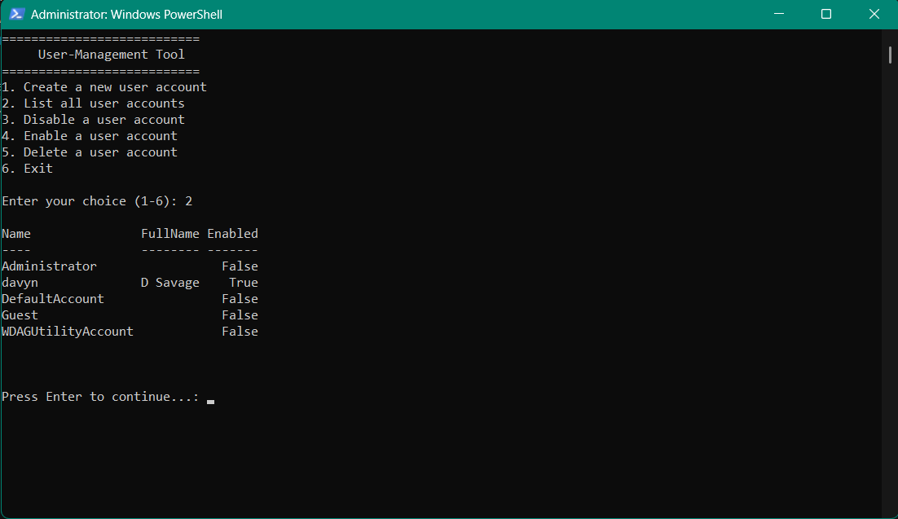

# PowerShell-UserManagementTool-1
Powershell Project to create a simple user management tool.
💼 PowerShell User Management Tool
A simple PowerShell-based user management tool for Windows environments. This project provides a menu-driven interface to perform basic local user account tasks, including creating, listing, disabling, enabling, and deleting user accounts.

📌 Features
Create a new local user account with a secure password

List all local user accounts in a clean table format

Disable or enable existing user accounts

Delete user accounts (with warning)

Runs continuously until the user chooses to exit

Includes basic error handling and admin permission checks

🛠 Technologies
PowerShell (Core Windows scripting language)

Built-in cmdlets: New-LocalUser, Get-LocalUser, Disable-LocalUser, Enable-LocalUser, Remove-LocalUser

Uses terminal-based interaction and secure string handling

🎯 Purpose
This project was built as a practical exercise to apply newly learned PowerShell scripting skills. It's aimed at:

Reinforcing command-line automation concepts

Demonstrating ability to script and troubleshoot in Windows environments

Providing a simple portfolio piece relevant to IT support and technical service desk roles

🧠 Notes
This script uses -ErrorAction Stop for clean exception handling.

All sensitive operations like account creation and deletion require elevation.

Built entirely with native PowerShell — no external modules needed.

Must be run with Administrator privileges

📷 Preview

📚 What I Learned
How to structure scripts with loops, conditionals, and user input

Using PowerShell cmdlets for local user management

Error handling using try/catch

Ensuring administrative privilege checks with [Security.Principal.WindowsPrincipal]

Creating reusable, terminal-friendly tools

